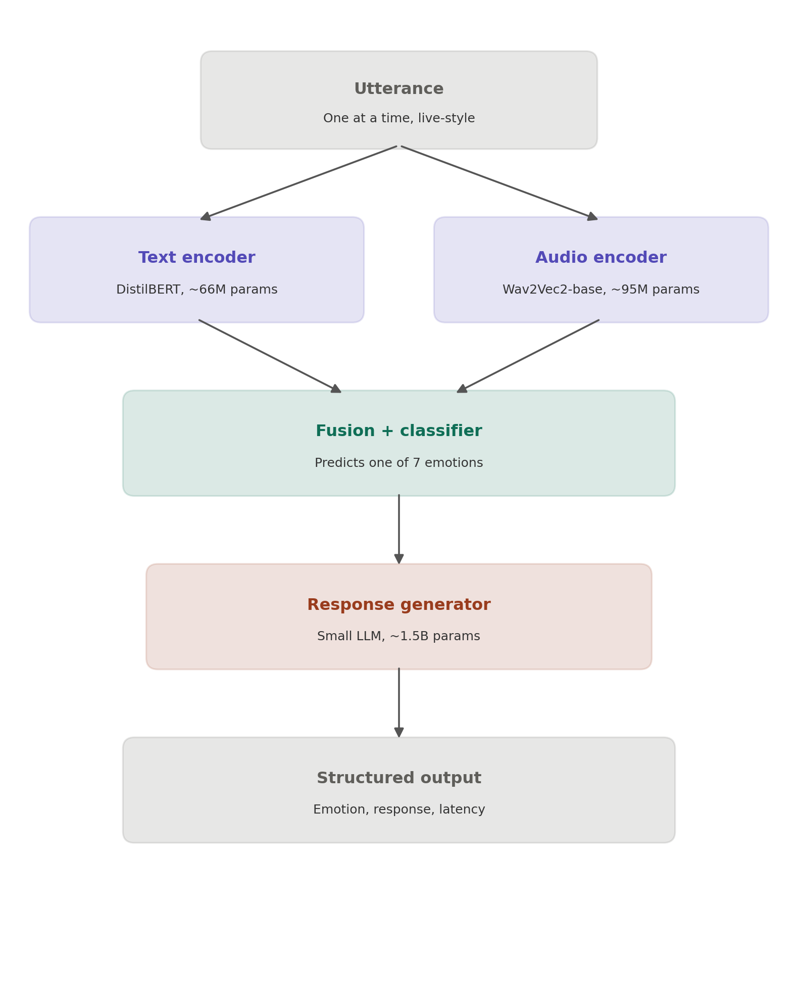

<div align="center">

# Real-Time Multimodal Emotion Model

**A small AI system that listens to a line of dialogue - text *and* tone of voice - figures out the emotion behind it, and replies in a way that actually matches that mood.**


Built for the **ML Challenge: Real-Time Multimodal ML Challenge**, using the **MELD dataset** (Multimodal EmotionLines Dataset).

</div>

---

## 💡 What This Project Does

Imagine a character robot listening to someone talk. It doesn't just hear the *words* - it also picks up on *how* something was said. "I'm fine." said flatly vs. said sharply means two very different things.

This system:

1. **Takes one line of speech at a time** - the text of what was said + the audio of how it was said
2. **Guesses the emotion behind it** - one of 7: neutral, joy, sadness, anger, surprise, fear, disgust
3. **Writes a short, natural reply** that reacts to that emotion
4. **Returns everything as clean, structured data** - ready for a robot, app, or any downstream system to use

---

## 🎯 Track Chosen: Text + Audio

MELD provides text, audio, and video. We chose **Text + Audio** over Text + Vision because MELD already provides audio per line in an easy-to-use form, while video would require extra work (extracting faces frame-by-frame) that wasn't worth the time trade-off for this challenge's timebox.

---

## 🏗️ Architecture

<div align="center">

</div>

**In plain terms:** the text and audio each get "read" separately by their own AI model, their understanding is combined into one summary, a small classifier we built and trained guesses the emotion from that summary, and a small language model writes a reply based on the emotion it detected.

---

## 🛠️ Tech Stack

| Purpose | Tool Used | Why |
|---|---|---|
| Reading text | DistilBERT | Small, fast, well-tested text model |
| Reading audio | Wav2Vec2-base | Standard model for understanding speech |
| Guessing emotion | Custom fusion classifier | Combines text + audio understanding into one decision |
| Writing replies | Qwen2.5-1.5B-Instruct | Small language model, good at short natural replies |
| Dataset | MELD (via Hugging Face) | Required by the challenge; real TV dialogue with emotion labels |
| Training environment | Google Colab (free GPU) | Fast enough to train without needing a personal GPU |
| Core libraries | Python, PyTorch, Hugging Face Transformers | Standard tools for this kind of AI work |

---

## ⏱️ Defining "Real-Time" for This Project

MELD is pre-recorded dialogue, not a live microphone feed. So we defined real-time as:

> **Feeding one utterance at a time, like a live conversation, and measuring how long each one takes to fully process - from raw input to final response.**

**Result: ~1 second per line on average (1,060 ms)**, tested on a Tesla T4 GPU - a reasonable pace for turn-based conversation. Response time ranged from 0.5s to 2.2s, mainly depending on how long the generated reply was.

---

## 📊 How Well Does It Work? (Honest Results)

Tested on **522 examples the model had never seen before.**

**Overall accuracy: 56.5%** - random guessing among 7 emotions would only get ~14%, so the model is clearly learning real patterns.

But accuracy isn't even across emotions:

| Emotion | Accuracy | Why |
|---|---|---|
| Neutral | 93% | Very common in the data (1,012 training examples) |
| Anger | 59% | Reasonably common, fairly distinct |
| Joy | 16% | Fewer examples, easy to confuse with neutral |
| Surprise | 28% | Fewer examples |
| Sadness | 2% | Very few examples (166), often subtle in tone |
| Fear | 0% | Extremely rare (39 examples) - not enough to learn from |
| Disgust | 0% | Extremely rare (53 examples) - not enough to learn from |

**We noticed this imbalance and tried to fix it.** Two different weighted-loss strategies were tested. Neither fully solved the problem - fear and disgust stayed at 0% regardless of weighting. This told us the real issue isn't the training method, it's that there simply isn't enough example data for those two emotions for a small model to learn reliable patterns from. We're reporting this honestly rather than hiding it - it's a genuine, evidence-backed limitation of using a small model on limited rare-class data within a short timebox.

---

## ⚙️ Resource Requirements

**Total parameters across the entire system: 1.705 billion** - the challenge allows up to 6 billion, so this uses about **28%** of the allowed budget.

| Component | Parameters |
|---|---|
| Text encoder (DistilBERT) | 66,362,880 |
| Audio encoder (Wav2Vec2-base) | 94,371,712 |
| Fusion + classifier (custom) | 395,271 |
| Response generator (Qwen2.5-1.5B) | 1,543,714,304 |
| **Total** | **1,704,844,167** |

**Hardware used:** Tesla T4 GPU (free tier, Google Colab)
**Peak GPU memory used:** 10.68 GB (of 15 GB available)

---

## 📄 Example Output

One real input traveling through the full system, start to finish:

```json
{
  "text": "Chandler what do you say?",
  "true_emotion": "neutral",
  "predicted_emotion": "neutral",
  "confidence": 0.869,
  "response_text": "Oh, that's Chandler? Sounds friendly enough! What's up?",
  "latency_ms": 1109.1
}
```

More examples are saved in [`outputs/sample_run.json`](outputs/sample_run.json).

---

## ✅ What We Completed

- Full end-to-end pipeline: text + audio in → detected emotion + natural reply out
- Trained and evaluated an emotion classifier on real MELD data
- Investigated and documented a real class-imbalance problem, including two honest attempts to fix it
- Defined and measured real-time behavior with actual latency numbers
- Verified the system stays well within the 6 billion parameter limit
- Reported real hardware and memory usage

## ❌ What We Intentionally Left Out

- **The optional standout extension** (combining vision + voice + text, or reinforcement learning) - chose to fully finish and document the required core task well rather than stretch into unfinished extra scope
- **True continuous audio streaming** - process one complete utterance at a time, a simpler and more honest scope given the timebox
- **Fixing the fear/disgust 0% accuracy** - tried two approaches and documented why neither fully worked; a real fix would likely require more training examples for these rare emotions

---

## 🚀 How to Run This Yourself

```bash
# 1. Install requirements
pip install -r requirements.txt

# 2. Log in to Hugging Face (needed to download the dataset and models)
python -c "from huggingface_hub import login; login()"

# 3. Run the demo - feeds sample utterances through the full pipeline
python scripts/run_demo.py
```

See [`notebooks/training.ipynb`](notebooks/training.ipynb) for the full training process, kept for transparency.

---

<div align="center">
<i>Built with a strong bias toward honest evaluation over polished-looking numbers.</i>
</div>
